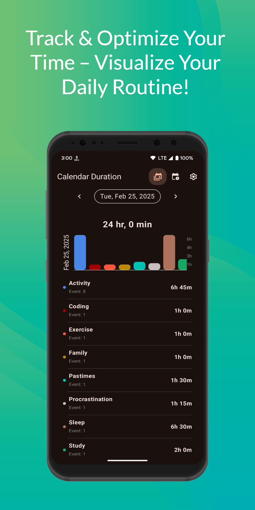
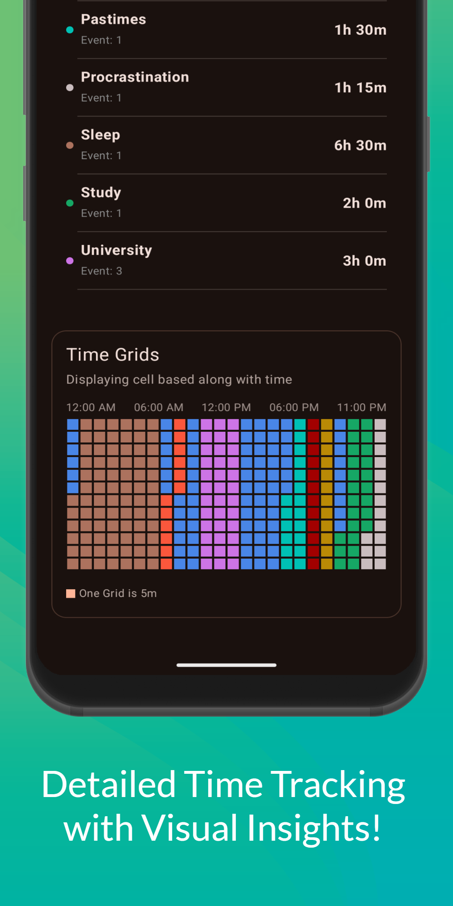
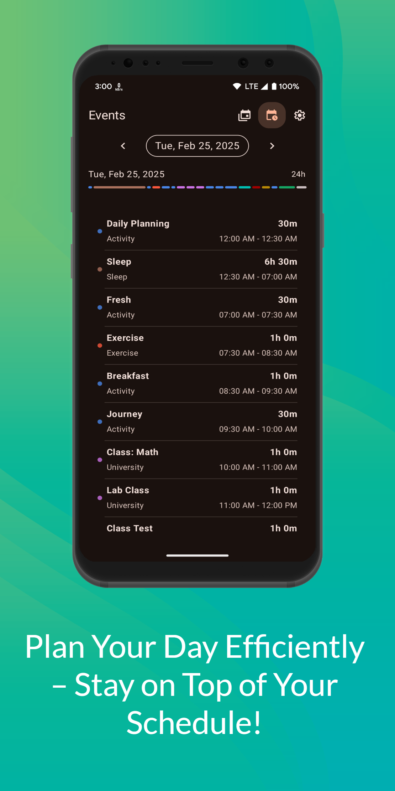
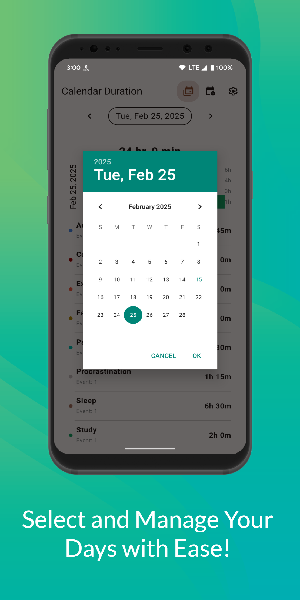
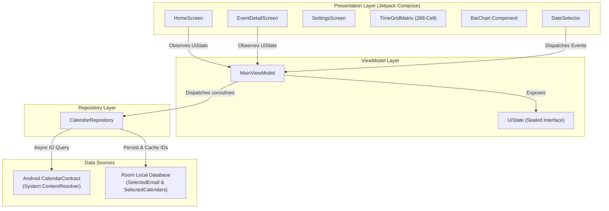

# 📅 Calendar Duration

<div align="center">


[](https://kotlinlang.org/)
[-3DDC84?style=flat-square&logo=android&logoColor=white)](https://developer.android.com/)
[](https://developer.android.com/jetpack/compose)
[](https://m3.material.io/)
[](https://developer.android.com/topic/architecture)
[](https://developer.android.com/training/data-storage/room)
[](LICENSE)

<br/>

**A modern, privacy-focused Android productivity app that transforms standard calendar events into visual time analytics, duration summaries, and 24-hour timeline heatmaps.**

[Overview](#-overview--problem-statement) •
[Screenshots](#-app-preview--screenshots) •
[Key Features](#-key-features) •
[Architecture & Design](#-architecture--system-design) •
[Technical Highlights](#-technical-deep-dive) •
[Tech Stack](#-technology-stack) •
[Project Structure](#-project-structure) •
[Getting Started](#-getting-started) •
[Privacy & Security](#-privacy--security)

</div>

---

## 💡 Overview & Problem Statement

Standard calendar applications (such as Google Calendar or Microsoft Outlook) excel at scheduling point-in-time alerts, invites, and notifications. However, they fall short when answering a fundamental productivity question:

> **"How many hours did I actually invest in specific projects, clients, or categories today?"**

Users managing multi-calendar setups (e.g., Work, Side Projects, Deep Work, Fitness, Family) are forced to either mentally tally event durations or manually enter time into secondary time-tracking software.

**Calendar Duration** solves this friction seamlessly. By reading directly from the Android native `CalendarContract` Content Provider, it computes aggregate durations, categorizes time allocation by calendar tags/colors, and renders a 288-cell 24-hour visual distribution grid—**100% on-device with zero privacy compromises**.

---

## 📱 App Preview & Screenshots

<div align="center">

| **1. Daily Analytics & Routine** | **2. 288-Cell Time Grid** | **3. Chronological Event Feed** | **4. Quick Date Navigation** |
|:---:|:---:|:---:|:---:|
|  |  |  |  |
| **Track & Optimize**<br/>Total daily duration summary, category breakdown & interactive bar chart | **Visual Insights**<br/>288-cell 24-hour timeline matrix with 5-minute precision | **Plan Efficiently**<br/>Proportional 24h progress bar & chronological event schedule | **Manage with Ease**<br/>Single-tap day stepper & interactive Material 3 date picker |

</div>

---

## ✨ Key Features

### ⏱️ Real-Time Duration Aggregation
- Automatically calculates and sums precise elapsed time (`X hr, Y min`) for all events scheduled across selected calendars for any chosen date *(e.g., 24h total tally in [Screen 1](images/screen_1.png))*.
- Instant date navigation with single-tap previous/next day steppers and an interactive calendar picker dialog *([Screen 4](images/screen_4.png))*.
- Pull-to-refresh integration for immediate calendar sync.

### 🧩 288-Cell 24-Hour Time Grid Matrix
- Custom-built visual day timeline broken down into **288 discrete blocks** (24 hour columns $\times$ 12 five-minute rows) *([Screen 2](images/screen_2.png))*.
- Each cell dynamically reflects scheduled events with 5-minute precision, color-coded directly to its native calendar category.
- Robust boundary logic handling single-hour blocks, multi-hour spans, and cross-midnight event transitions.

### 📊 Category-Based Interactive Bar Chart
- Displays proportional time commitments across calendars with dynamic Y-axis hour scaling *([Screen 1](images/screen_1.png))*.
- Interactive bars: tap on any calendar bar to launch an event breakdown dialog listing all sub-events.
- Native Canvas rotated text rendering for clean, compact date labels.

### 📏 Proportional Time Tracking Line
- Continuous segmented horizontal visualizer showing the exact percentage distribution of your schedule across the 24-hour day *([Screen 3](images/screen_3.png))*.
- Instant visual sense of workload balance and category distribution between tasks throughout the day.

### 📋 Detailed Event Activity Feed
- Chronological breakdown of events with formatted timeframes (`10:00 AM - 12:00 PM`), calculated durations (`2h 30m`), and color indicators *([Screen 3](images/screen_3.png))*.
- Displays calendar tags (e.g. *Activity*, *Sleep*, *Exercise*, *University*) alongside individual event titles.
- Graceful truncation and responsive typography avoiding layout shifts on small screens.

### ⚙️ Multi-Account & Multi-Calendar Filtering
- Filter calendars by Google Account or local account.
- Select/deselect individual calendars with persistent caching in **Room Database**.
- One-tap configuration reset to switch active accounts and calendar subsets.

### 🎨 Material 3 & Dynamic Theming
- Native **Material You (M3)** with dynamic color adaptation on Android 12+ (API 31+).
- Full dark mode and light mode support with adaptive contrast adjustments.

---

## 🏛️ Architecture & System Design

The application adheres to official **Android Modern Architecture Guidelines**, implementing the **MVVM (Model-View-ViewModel)** architectural pattern with **Unidirectional Data Flow (UDF)** and a clean separation of concerns.



### Architectural Highlights

| Layer | Component | Responsibility |
|---|---|---|
| **Presentation** | Jetpack Compose & Material 3 | Declarative UI rendering, responsive state observation, gesture handling, and custom Canvas drawing. |
| **State Management** | `MainViewModel` | Exposes immutable `UiState` via Compose `State<T>`, triggers asynchronous loading in `viewModelScope`, and coordinates business logic. |
| **Repository** | `CalendarRepository` | Single source of truth. Bridges local persistence with the device's native `CalendarContract` ContentResolver via `Dispatchers.IO`. |
| **Local Storage** | Room Database | Stores user preferences (`SelectedEmail`, `SelectedCalendar` IDs) with fast query/replace operations. |
| **Platform Integration** | Android `ContentResolver` | Queries system `CalendarContract.Calendars` and `CalendarContract.Events` tables for real-time calendar synchronization. |

### Unidirectional Data Flow (UDF) & State Model

```kotlin
sealed class UiState {
    object Loading : UiState()
    data class ShowEmailSelection(val emails: List<String>) : UiState()
    data class ShowCalendarSelection(val calendars: List<CalendarInfo>) : UiState()
    data class ShowEventsList(val events: List<CalendarEvent>) : UiState()
    data class ShowError(val title: String, val message: String) : UiState()
}
```

---

## 🔬 Technical Deep Dive

### 1. The 288-Cell 24-Hour Time Grid Algorithm

To visualize a full 24-hour day with 5-minute precision without degrading performance:
- A day consists of $24 \text{ hours} \times 12 \text{ intervals} = 288 \text{ cells}$.
- The grid is rendered using an optimized `LazyVerticalGrid(columns = GridCells.Fixed(24))`.
- Each slot index $k \in [0, 287]$ maps directly to:
  $$\text{Hour (Column)} = k \pmod{24}, \quad \text{5-Minute Interval (Row)} = \lfloor k / 24 \rfloor$$
- Start and end timestamps are parsed into `(startRow, startCol)` and `(endRow, endCol)`.
- The matching algorithm evaluates range overlap across three conditions:
  1. **Intra-Hour Events**: $\text{col} = \text{startCol} \land \text{row} \in [\text{startRow}, \text{endRow})$
  2. **Multi-Hour Events**: Spanning from `startCol` through intermediate hours to `endCol` with interval bounding.
  3. **Midnight-Crossing Events**: Spanning across day boundaries without index out-of-bounds exceptions.

```kotlin
// Time slot resolution mapping (utils / TimeGridMatrix)
fun getGridRowColForTime(time: String): Pair<Int, Int> {
    val dateTime = LocalDateTime.parse(time, DateTimeFormatter.ofPattern("yyyy-MM-dd HH:mm:ss"))
    val row = dateTime.minute / 5  // 5-minute row index (0..11)
    val col = dateTime.hour        // Hour column index (0..23)
    return Pair(row, col)
}
```

### 2. High-Performance ContentResolver Querying

Rather than pulling all calendar data into memory, `CalendarUtils` leverages parameterized SQL projection against the Android system provider:
- Filters explicitly for user-selected calendar IDs: `CALENDAR_ID IN (?, ?, ...)`
- Bounds start and end epoch timestamps: `DTSTART >= ? AND DTSTART <= ?`
- Automatically filters out all-day events (`ALL_DAY == 1`) and midnight markers to avoid skewing work-duration analytics.
- Cursor results are mapped directly to immutable `CalendarEvent` data objects within non-blocking Kotlin coroutines (`withContext(Dispatchers.IO)`).

### 3. Local State Caching with Room

```kotlin
@Dao
interface CalendarDao {
    @Query("SELECT email FROM selected_email LIMIT 1")
    suspend fun getSelectedEmail(): String?

    @Insert(onConflict = OnConflictStrategy.REPLACE)
    suspend fun insertSelectedEmail(selectedEmail: SelectedEmail)

    @Query("SELECT calendarId FROM selected_calendars")
    suspend fun getSelectedCalendars(): List<Long>

    @Insert(onConflict = OnConflictStrategy.REPLACE)
    suspend fun insertSelectedCalendars(calendars: List<SelectedCalendar>)
}
```

---

## 🛠️ Technology Stack

| Category | Technology | Purpose |
|---|---|---|
| **Language** | [Kotlin 2.0.21](https://kotlinlang.org/) | Modern concise, type-safe programming language with coroutines |
| **UI Toolkit** | [Jetpack Compose](https://developer.android.com/jetpack/compose) (BOM 2024.04.01) | Declarative UI, reactive state binding, Canvas rendering |
| **Design System** | [Material 3](https://m3.material.io/) | Material You color schemes, dynamic dark/light theme |
| **Architecture** | Android Architecture Components | ViewModel, Live Lifecycle, Type-Safe Compose Navigation |
| **Database** | [Room 2.6.0](https://developer.android.com/training/data-storage/room) | Local SQLite persistence for user settings and calendar filters |
| **Asynchronous** | [Kotlin Coroutines](https://kotlinlang.org/docs/coroutines-overview.html) | Asynchronous task scheduling and background IO operations |
| **Serialization** | [Kotlinx Serialization](https://github.com/Kotlin/kotlinx.serialization) | Type-safe route navigation arguments |
| **Platform APIs** | Android `CalendarContract` | Native access to system-synced Google and local calendars |
| **Monetization** | Google Play Services Ads (AdMob) | Non-intrusive banner ad integration |
| **Build System** | Gradle Kotlin DSL (`build.gradle.kts`) | Modern, type-safe build script configuration |

---

## 📂 Project Structure

```
CalendarDuration/
├── app/
│   ├── src/
│   │   ├── main/
│   │   │   ├── java/com/shefasoft/calendarduration/
│   │   │   │   ├── data/
│   │   │   │   │   └── local/             # Room DB: Entities, AppDatabase, CalendarDao
│   │   │   │   ├── model/                  # Domain Data Models (CalendarEvent, CalendarInfo)
│   │   │   │   ├── repository/             # Repository Pattern (CalendarRepository)
│   │   │   │   ├── ui/
│   │   │   │   │   ├── components/         # Reusable Compose widgets (TimeGridMatrix, DateSelector, etc.)
│   │   │   │   │   ├── navigation/         # Type-safe Destinations and NavGraph
│   │   │   │   │   ├── screens/            # Full-page screens (HomeScreen, EventDetailScreen, Settings)
│   │   │   │   │   └── theme/              # Color schemes, Typography, Material 3 Theme setup
│   │   │   │   ├── utils/                  # ContentResolver helpers (CalendarUtils) & formatting
│   │   │   │   ├── viewModel/              # MainViewModel, UiState, ViewModelFactory
│   │   │   │   └── MainActivity.kt         # Single-activity host with permission handling
│   │   │   ├── res/                        # Vector drawables, mipmaps, strings, themes
│   │   │   └── AndroidManifest.xml         # App manifest & permissions
│   │   └── test/                           # Unit tests
│   └── build.gradle.kts                    # App module dependencies
├── gradle/
│   └── libs.versions.toml                  # Version Catalog for centralized dependency management
└── build.gradle.kts                        # Root project build configuration
```

---

## 🚀 Getting Started

### Prerequisites

- **Android Studio**: Ladybug (2024.2.1+) or newer
- **JDK**: Java Development Kit 11 or 17
- **Android SDK**:
  - `minSdkVersion`: 26 (Android 8.0 Oreo)
  - `compileSdkVersion` & `targetSdkVersion`: 35 (Android 15)
- An Android physical device or emulator with Google Play Services and at least one synced calendar account.

### Installation & Build

1. **Clone the repository:**
   ```bash
   git clone https://github.com/ssaammii5/CalendarDuration.git
   cd CalendarDuration
   ```

2. **Open in Android Studio:**
   - Launch Android Studio, choose **File > Open**, and select the cloned directory.
   - Let Gradle sync the project dependencies.

3. **Build the Debug APK via CLI:**
   ```bash
   ./gradlew assembleDebug
   ```

4. **Run Unit Tests:**
   ```bash
   ./gradlew test
   ```

5. **Deploy to Device:**
   Connect your Android device with USB debugging enabled, then run:
   ```bash
   ./gradlew installDebug:
   ```

---

## 🔒 Privacy & Security

Calendar Duration was engineered with a strict **Privacy-First** ethos:

- **No Remote Servers**: Event titles, dates, descriptions, and account names are processed **entirely on your device**.
- **No Analytics / Event Tracking**: The app never transmits calendar content or personal logs to any external server.
- **Explicit Permission Scoping**:
  - `android.permission.READ_CALENDAR`: Required strictly to read event start and end timestamps from the local Android Calendar Provider.
- **Sandboxed Storage**: All cached preferences (such as selected calendar IDs) are securely stored in the application's private Room SQLite database.

---

## 📄 License

This project is licensed under the [Apache License 2.0](LICENSE) - see the LICENSE file for details.
